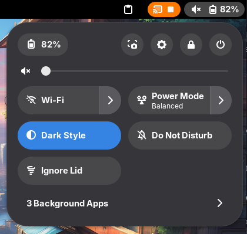
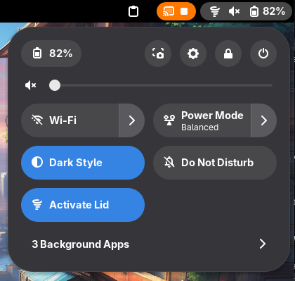

# Ignore Lid 🌪️

|  |  |
|:---:|:---:|
| Extension toggle disabled - Lid is active | Extension toggle enabled - Lid is ignored |

This exntesion simply blocks the lid-switch on distros with systemd, to temporarily close your laptop and move without disrupting anything actively running. It does it by making a D-Bus InhibitRemote call to logind, which opens and returns a file descriptor. As long as the file descriptor is open, the lid switch is ignored. You can verify the block by checking the output of `systemd-inhibit --list`.

<a href="https://extensions.gnome.org/extension/10006/ignore-lid/">
  
</a>

> Important note: This extension only disables the lid switch. It does not alter any power management settings. For this, you might want to use an extension like [Caffeine](https://extensions.gnome.org/extension/517/caffeine/) in combination with this one.

## Prerequisites
- Gnome Shell 49
- systemd with logind

## Manual Installation
1. Clone the repository into ~/.local/share/gnome-shell/extensions/:
   ```bash
   cd ~/.local/share/gnome-shell/extensions/
   git clone git@github.com:mfloto/ignore-lid.git
   ```
2. Enable extension using Gnome Extensions or the following command:
   ```bash
   gnome-extensions enable ignore-lid@gnome-extensions.mfloto.com
   ```

## Development
For development and testing use e.g. the following command to create a windowed wayland session:
```bash
dbus-run-session gnome-shell --devkit --wayland
```

And enable the extension within the windowed session with:
```bash
gnome-extensions enable ignore-lid@gnome-extensions.mfloto.com
```

Building the extension into a zip file can be done with the following command:
```bash
gnome-extensions pack --force
```
